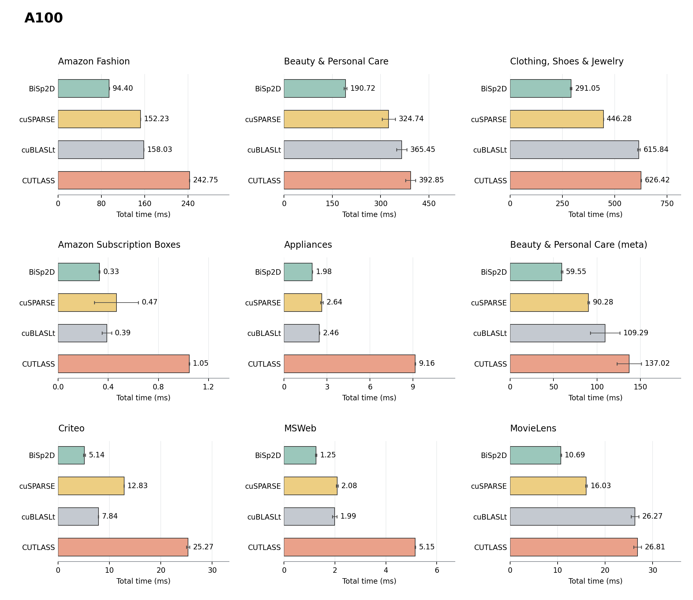
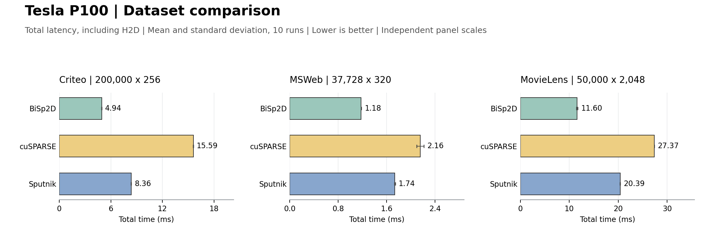

# BiSp2D

GPU-accelerated co-occurrence matrix construction for binary incidence matrices.

Given a binary matrix `V` with instances as rows and features as columns, BiSp2D computes the exact counts in `C = V^T V`. It packs the input into the 64-bit **BaSC** format and evaluates column intersections with **BaSC-GEMM**, using tiled, vectorized access and symmetric output computation.

## Performance

### NVIDIA A100: nine dataset configurations

Total time includes H2D, GPU format preparation and computation. Bars show the mean of five runs with sample standard deviation. Lower is better; panels use independent scales.



BiSp2D achieves **1.18–1.70×** speedup over the fastest baseline among cuBLASLt, CUTLASS and cuSPARSE across these nine configurations.

### Tesla P100: cuSPARSE and Sputnik

Total time includes H2D, GPU format preparation and computation. Results use ten measured runs after two warm-ups; error bars show sample standard deviation. Each panel starts at zero and uses its own scale.



Across these three configurations, BiSp2D achieves **1.83–3.16×** speedup over cuSPARSE and **1.47–1.76×** over Sputnik. The plotted Sputnik baseline is the **integer-adapted implementation** used in the experiment.

The figures use recorded baseline experiments, separate from the random-input benchmark below. P100 feature dimensions are shown in the panel titles and differ from `datasets.csv`. See [comparison data and timing definitions](docs/results/README.md).

## How it works

```text
Binary input V (int8_t)
    -> H2D transfer + Build_BaSC (64-bit packing)
    -> BaSC-GEMM (AND + bit count, symmetric output)
    -> Co-occurrence counts C = V^T V
```

## Quick start

Requires an NVIDIA GPU, CUDA 12 or later, a C++17-capable host compiler, and Python 3. The default build targets `sm_80`.

```bash
git clone https://github.com/ccsky37/BiSp2D.git
cd BiSp2D
./run.sh 5 5
```

This builds the executable and runs all nine configurations in [datasets.csv](datasets.csv), with five warm-ups and five measured runs. It generates random binary inputs with a fixed seed and prints a timing table.

## Data and timing

[datasets.csv](datasets.csv) records the nine dataset names, dimensions and sparsity settings. The supplied benchmark generates random matrices at those settings; it does not load or redistribute the original datasets.

Original dataset sources: [Amazon Reviews 2023](https://amazon-reviews-2023.github.io/main.html), [Criteo](https://ailab.criteo.com/ressources/), [MSWeb](https://kdd.ics.uci.edu/databases/msweb/msweb.html), and [MovieLens](https://grouplens.org/datasets/movielens/).

For application data, prepare a row-major `int8_t` matrix containing only 0 and 1 and call [runBiSp2D()](include/bisp2d.cuh).

| Output | What it measures |
|---|---|
| H2D | Dense binary input transfer to the GPU. |
| Build BaSC | GPU construction of the packed representation. |
| BaSC-GEMM | Co-occurrence computation on the packed representation. |
| Device-side Work | Build BaSC + BaSC-GEMM. |
| GPU Total | Independently timed H2D-to-computation completion window. |

Input generation and validation are excluded. H2D and BaSC construction overlap across four CUDA streams, so the total need not equal the sum of the component timings.

<details>
<summary>Previously recorded A100 random-input benchmark</summary>

A100 PCIe 40 GB, CUDA 12.4, `g=4`, five warm-ups and five measured runs. This separate benchmark is not used in the comparison figures above.

| Dataset | Instances | Features | Sparsity | H2D (ms) | Device-side Work (ms) | Total (ms) |
|---|---:|---:|---:|---:|---:|---:|
| Amazon Fashion | 2,035,520 | 512 | 99.76% | 89.537 | 8.235 | 97.762 |
| Beauty & Personal Care | 2,000,000 | 1,024 | 99.66% | 172.246 | 16.280 | 188.512 |
| Clothing, Shoes & Jewelry | 1,516,928 | 2,048 | 99.68% | 260.097 | 40.575 | 300.650 |
| Amazon Subscription Boxes | 15,264 | 128 | 99.18% | 0.212 | 0.089 | 0.295 |
| Appliances | 89,664 | 160 | 99.38% | 1.242 | 0.339 | 1.576 |
| Beauty & Personal Care (meta) | 926,048 | 704 | 99.86% | 53.892 | 3.797 | 57.679 |
| Criteo | 200,000 | 224 | 88.39% | 3.753 | 0.576 | 4.323 |
| MSWeb | 37,728 | 288 | 98.95% | 0.952 | 0.132 | 1.077 |
| MovieLens | 50,000 | 2,000 | 99.71% | 8.309 | 1.279 | 9.576 |

</details>

## Repository

| Path | Contents |
|---|---|
| [src/](src/) | BiSp2D implementation and random-input executable. |
| [include/bisp2d.cuh](include/bisp2d.cuh) | Public API and timing structures. |
| [bench.py](bench.py), [run.sh](run.sh) | Nine-configuration benchmark runner. |
| [docs/results/](docs/results/) | Archived comparison data and provenance. |
| [docs/plot_results.py](docs/plot_results.py) | Regenerates the README comparison figures. |

External baseline implementations and their GPU experiment harnesses are not bundled. The figures can be regenerated from the included data without a GPU.

## License

[MIT](LICENSE).
